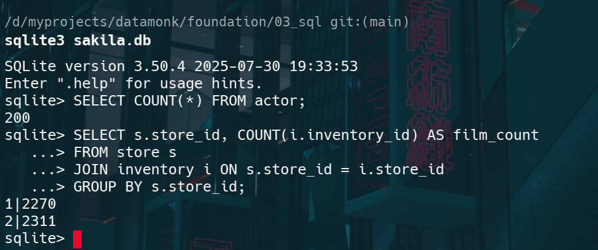
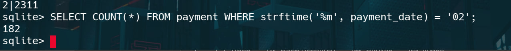
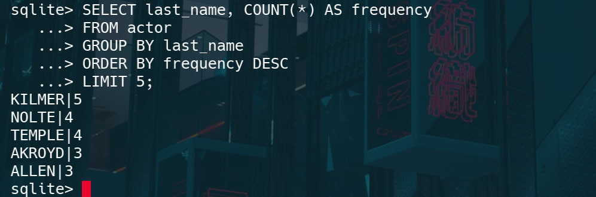
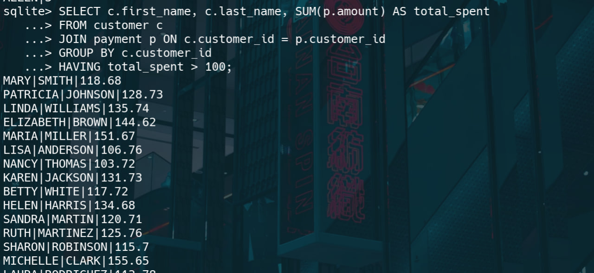

# Q. List all stores and how many films each has in inventory?

# Q. What is the total number of payments made in February?

# Q. Which languages are used in the film catalog?

# Q. What are the five most frequently occurring actor last names?

# Q. Which customers have spent more than $100 in total payments?

